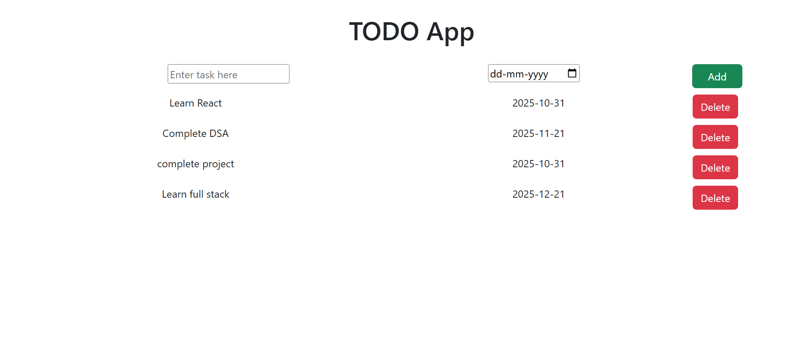

# 📝 TODO App

A simple and responsive **TODO App** built using **React JS** and **Vite**.  
This app helps you manage your daily tasks effectively by allowing you to **add**, **view**, and **delete** tasks with associated due dates.

---

## 🚀 Features

- ✨ Add new tasks with a specific due date.  
- 🗑️ Delete tasks once completed.  
- 📅 Displays tasks with their corresponding deadlines.  
- ⚡ Built with **Vite** for fast development and build performance.  
- 💻 Clean and minimalist UI using basic CSS for styling.  

---

## 📸 Screenshot

Here’s how the app looks:



*(Make sure your screenshot image is saved inside the `public` folder and the path matches exactly as shown above.)*

---

## 🧩 Project Structure

```

todo-app/
│
├── public/
│   ├── Screenshot 2025-10-21 105016.png
│
├── src/
│   ├── components/
│   │   └── Todo.jsx
│   ├── App.jsx
│   ├── main.jsx
│   └── index.css
│
├── package.json
├── vite.config.js
└── README.md

````

---

## ⚙️ Installation & Setup

Follow these steps to run the project locally:

```bash
# Clone this repository
git clone https://github.com/your-username/todo-app.git

# Navigate into the project directory
cd todo-app

# Install dependencies
npm install

# Start the development server
npm run dev
````

Your app will be available at 👉 **[http://localhost:5173](http://localhost:5173)**

---

## 🧠 How It Works

1. Type a task in the input field.
2. Select a **due date** using the date picker.
3. Click the **Add** button to add your task.
4. Tasks will appear in a list with their respective due dates.
5. Click the **Delete** button to remove a task.

---

## 🛠️ Technologies Used

* **React JS**
* **Vite**
* **HTML5**
* **CSS3**
* **JavaScript (ES6)**

---

## 📄 Future Improvements

* ✅ Add task editing functionality.
* ✅ Include task completion status (checkbox).
* ✅ Store tasks in local storage or database for persistence.
* ✅ Add filters for completed and pending tasks.

---

```
